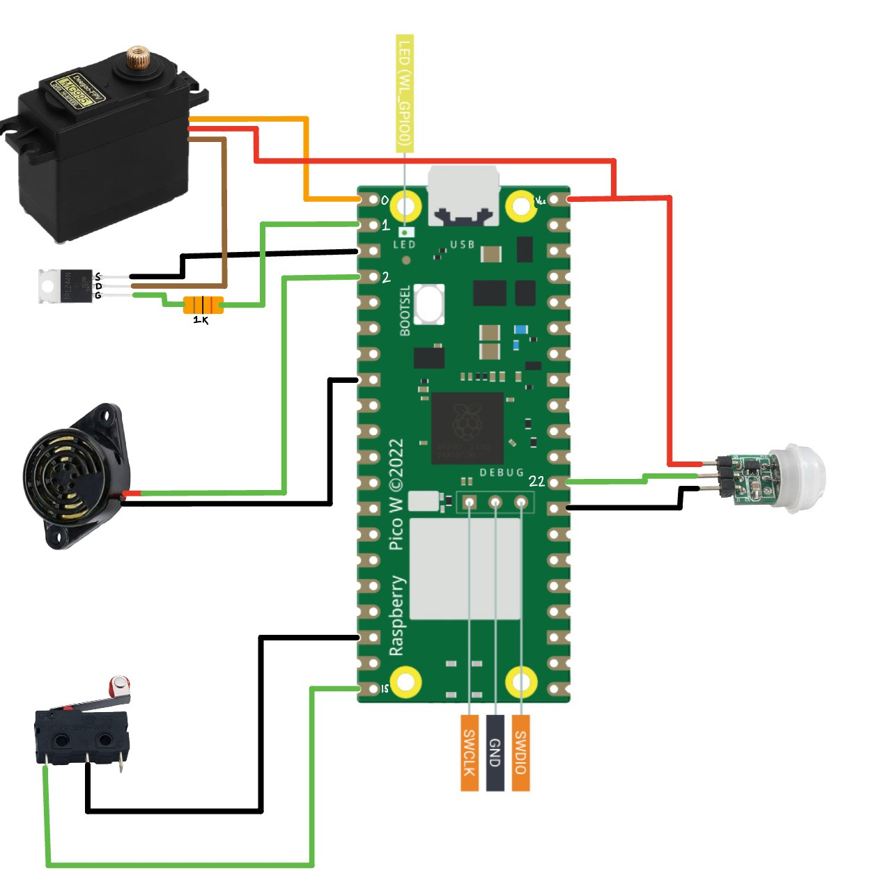

# Smart_Toilet_Project_SP25
Automated Toilet Seat Controller
An automated toilet seat system designed to enhance hygiene and convenience in bathrooms. This project integrates sensor inputs and actuator control using a microcontroller running MicroPython. The system uses a PIR motion sensor to detect proximity, a pressure switch to sense occupancy, a servo for seat actuation, and a speaker for audio feedback.

# Table of Contents
- [Overview](#overview)
- [The Circuit](#the-circuit)
- [Parts List](#parts-list)
- [Features](#features)
- [Hardware Requirements](#hardware-requirements)
- [Software Structure](#software-structure)
- [Setup & Installation](#setup--installation)
- [Usage](#usage)
- [Versions](#external-specifications-on-software-and-firmware-versions)

# Overview
The Automated Toilet Seat Controller automates the operation of a toilet seat based on user presence and interactions. When the PIR sensor detects motion near the toilet, the system opens the seat by actuating a servo. It then waits for the user to sit down (detected via a pressure switch connected between ground and gp15) and later to stand up. Once the user leaves, the system delays for a predetermined period before closing the seat. Audio tones are played during both the opening and closing operations to provide audible feedback.

# The Circuit

# Parts List
| Component         | Part Name/Number                                | Quantity Needed | Amazon Link |
|-------------------|-------------------------------------------------|-----------------|-------------|
| Servo Motor       | MG995 servo motor                               | 1               | [link](https://www.amazon.com/Control-Angle180-Digital-Torque-Helicopter/dp/B0D7M4LHBP/ref=asc_df_B07NQJ1VZ2?mcid=2dedb8a3a0973d19a870c56a0b430c95&hvocijid=1454523823739028590-B07NQJ1VZ2-&hvexpln=73&tag=hyprod-20&linkCode=df0&hvadid=721245378154&hvpos=&hvnetw=g&hvrand=1454523823739028590&hvpone=&hvptwo=&hvqmt=&hvdev=c&hvdvcmdl=&hvlocint=&hvlocphy=9028893&hvtargid=pla-2281435178858&th=1) |
| Motion Sensor     | Mini Pyroelectric PIR Motion Sensor Module      | 1               | [link](https://www.amazon.com/DIYables-Pyroelectric-Infrared-Detector-Raspberry/dp/B0CSD2K25B/ref=sr_1_1?crid=D3LFSI8CAS53&dib=eyJ2IjoiMSJ9.tlWUOi6-tZJf7KLplr3NlA.5Ky74crpt80yqrC5ARZsf2Mcwth1u3EUSlYAhnLuiHE&dib_tag=se&keywords=DIYables+mini+pyroelectric&qid=1744763806&s=hi&sprefix=diyables+mini+pyroelectric%2Ctools%2C91&sr=1-1) |
| Limit Switch      | HiLetgo 10pcs Micro Limit Switch KW12-3         | 1               | [link](https://www.amazon.com/HiLetgo-KW12-3-Roller-Switch-Normally/dp/B07X142VGC/ref=asc_df_B07X142VGC?mcid=4a4e088664e83f418ac7b98a6b585fff&hvocijid=8089192941682463272-B07X142VGC-&hvexpln=73&tag=hyprod-20&linkCode=df0&hvadid=721245378154&hvpos=&hvnetw=g&hvrand=8089192941682463272&hvpone=&hvptwo=&hvqmt=&hvdev=c&hvdvcmdl=&hvlocint=&hvlocphy=9028893&hvtargid=pla-2281435177818&psc=1) |
| Speaker           | SFM-27 DC 3-24V Electronic Piezo Buzzer         | 1               | [link](https://www.amazon.com/Stemedu-Decibel-Sounder-Electronic-Continuous/dp/B096P5K9W1/ref=sr_1_3?crid=199JEZIMB6Q3D&dib=eyJ2IjoiMSJ9.DJW2EftLw8VHxUTkslkWmgT9VvnLWlOX7qfBJBEkCpHawB1g2liaJZzGNYTvVmBtJUKjQX4HjeXUJgiNSKfc8SQwQspb-RvHwaeOxggFMyXt_GzLiEjPrOwUX_S4eqNC64WKWtzGeAIqk0MvV9Iiz8seB-J4hxYt1j9uJlZsIqTutPeSDj6Im74T6FQmmvBdxlIW5W1gO5GL9d_Y-Esk8WlBCIW39BEEew-hA2WW8Xw.a934F1XWBUmgIFOz5932YGLu469c5K_vl1ycyUWczWc&dib_tag=se&keywords=SMF-27+speaker+STEMDU+piezo+active+buzzer&qid=1744764273&sprefix=smf-27+speaker+stemdu+piezo+active+buzzer%2Caps%2C106&sr=8-3) |
| MOSFET            | IRLZ44N IRLZ44 MOSFET Transistor                | 1               | [link](https://www.amazon.com/ALLECIN-IRLZ44N-Transistors-IRLZ44NPBF-Mosfets/dp/B0CBKH4XGL/ref=sr_1_1_sspa?crid=1XBRZ3T3FVGCH&dib=eyJ2IjoiMSJ9.JWs5mn6Hgy1aEsOzFISaSw4UPHr4V6ZJEmhvAyCbiBa_ygvxDkkE9v85JW0u1NXB68UDF66-3kXeS2AfSFKkSNrtTUsYiz23lnkStQxQRKqKDwl6M7vmdQ9Ycmo6E7KO2OYoqQo1-F66uey6iewsqS9jHHWm4quKUi1DOWyyFXHFWNavP-1UHU0c3FBrmCWP1A3V3zZJdfOrpEJjAVFE2MPl_G3HmOJgAWt0vgAbCG0.7AyXRh7VwJwjrKelvsWM63ebUwoBX4BOOuTbckKBzek&dib_tag=se&keywords=allecin%2BIRLZ44%2BMOSFET&qid=1744764388&sprefix=allecin%2Birlz44%2Bmosfet%2Caps%2C111&sr=8-1-spons&sp_csd=d2lkZ2V0TmFtZT1zcF9hdGY&th=1) |
| Micro-Controller  | Raspberry Pi Pico W                             | 1               | [link](https://www.amazon.com/Raspberry-Pi-Pico-Development-Integrated/dp/B0BDLHMQ9C/ref=sr_1_1?crid=P1DA7WO45H5S&dib=eyJ2IjoiMSJ9.he0hzmPd1R2DUnSic2bLdKTN4lmziVRnKyFgihHbmU7dJ88BFkijCRwp2JjgSjvOxI9xluF-wrpT_Wo14bNosGtBRZdQeIVHzazvJcPKOVZpRPWsJhzH-N4yRXb0mBl07oyykCfEXuVc2rnGIE64GkFeni7JYQhNgUyaGJGycRXh2JQ9i9GxUFJyNs09Lw_oSOBJ6D3DOX5KqOLmhqN0VATMZVxobsp0WktLAQO03_E.iYUVHGtKe7jyeJB1T_Tp35mjKSSZRP_VfWNXzHZLgX0&dib_tag=se&keywords=raspberry+pi+pico&qid=1744764517&sprefix=rassberrry+%2Caps%2C124&sr=8-1) |

# Features
Motion Detection: Uses a PIR sensor connected to a designated GPIO pin to monitor activity.

Occupancy Sensing: Incorporates a pressure switch to determine if someone is sitting on the toilet seat.

Servo Actuation: Controls the movement of the toilet seat with precise servo motor actions.

Audio Feedback: Utilizes a speaker to play tones or a jingle during key operations (opening/closing the seat).

Modular Design: Code is organized into separate modules for motion detection, servo control, and sound generation, simplifying development, maintenance, and testing.
> Also mechanically modular, with multiple part being able to be designed for different toilet seats, and applications(trashcan)

# Hardware Requirements
Microcontroller: Raspberry Pi Pico running MicroPython.

PIR Motion Sensor (DIYables mini pyroelectric PIR): Connected to GPIO Pin 22 for motion detection.

Pressure Switch (HiLetgo limit switch): Connected to GPIO Pin 15 (with an internal pull-up resistor) to sense seat occupancy.

Servo Motor (MG995): Controlled via PWM (using GPIO Pin 0) with an additional control switch (GPIO Pin 1) as required by the servo circuit.
> IRLZ44N Transistor to switch power to the Servo.

Speaker (Stemedu Piezo Active Buzzer): Driven by PWM on GPIO Pin 2 for audio output.

3D Pritned Components: to deal with actuation.

# Software Structure
> The project is organized into multiple files, each encapsulating a specific aspect of the system:

main.py:
>Acts as the central controller. It initializes all modules, plays startup tones, performs an initial servo test, and enters the main loop where it monitors the PIR sensor. Upon detecting motion, it triggers the servo to open the seat, waits for the pressure switch to >sense occupancy changes, and finally commands the servo to close the seat after specified delays while providing audio feedback.

Motion.py:
>Contains the logic for initializing the PIR sensor and updating a flag based on motion detection. It provides a simple function to check the sensor state.

Servo_Control.py:
>Manages servo motor actuation using PWM. It calculates duty cycle values for the desired open and closed angles, provides functions to open and close the seat, and includes a test function for simulating movement. Audio feedback is integrated into these functions.

Speaker.py:
>Controls the speaker output by defining a melody and providing functions to play individual tones or sequences (jingles). It is used by the servo module to provide confirmation sounds during seat movement.

Main_control.py:
>Contains legacy code that was used during servo development and is kept for reference and documentation purposes. It is not actively executed when the device is in operation.

# Setup & Installation
# Hardware Setup:

Connect the PIR sensor to GPIO Pin 22.

Wire the pressure switch between ground and GPIO Pin 15.

Connect the servo motor to the designated PWM output (GPIO Pin 0) and link the control switch (IRLZ44N transistor) to GPIO Pin 1.

Attach the speaker to GPIO Pin 2.

Ensure all power and ground connections are secure.

# Mechanical Setup

3d print all provided STLs as they are all necessary for full assembly.
>print in a durable material (petg was used in this case) Glass or Carbon filled filaments may work well for its durability

Attach servo to bracket using 10-24 x 1/2 screws

Utilize cable shielding out of the Brain Case to ensure water resistance.

Mount piezo speaker inside Brain Case using 8-32 x 1/2 screws.

Remove toilet bolt on the right hand side and insert and retighten through servo bracket.

Attach switch to side of toilet with VHB tape.

Attach flat board and Magic eraser to under side of seat using VHB tape.

Perform Software Installation.

Initialize entire project and unplug device when servo moves once.

Attach servo arm using provided screw.

Attach a command hook near bottom of toilet.

Attach 2 rubber bands between the command hook and servo arm.
>Can be adjust depending on weight of seat

# Software Installation:

Install MicroPython on your microcontroller if not already done.

Clone or download this repository to your development environment.

Upload the files (main.py, Motion.py, Servo_Control.py, Speaker.py) to the microcontroller.

# Usage
After completing the setup:

Power up the microcontroller.

The main.py script will run automatically, initializing the system by playing a series of tones.

The servo will perform an initial test of opening and closing the seat.

The system continuously monitors the PIR sensor. When motion is detected, the seat opens.

The system then waits for a user to sit on the seat (pressure switch activated) and to stand up, after which the seat will close after a short delay.

Audio feedback is provided during both the opening and closing operations.

# External specifications on software and firmware versions
* MicroPython v1.24.1 
* Raspberry Pi Pico W with RP2040
* Python version - 3.13.1
